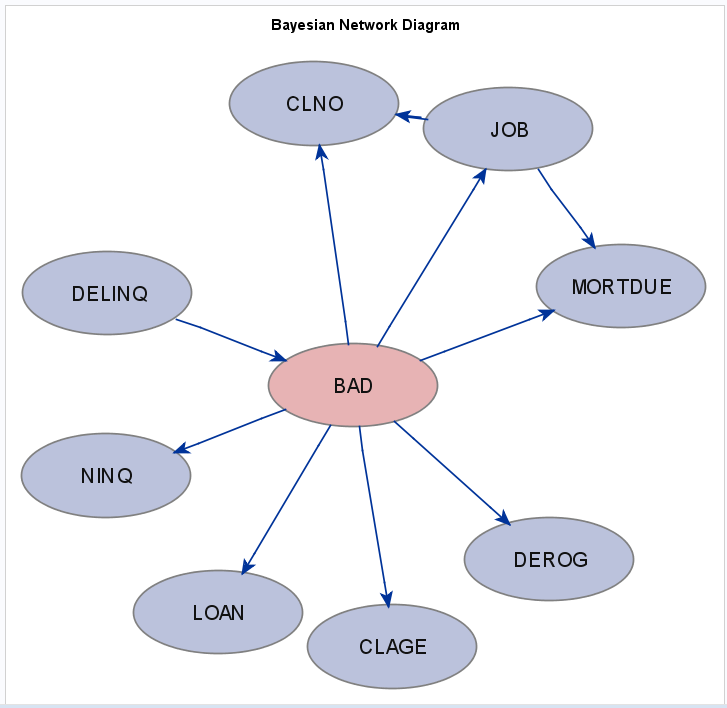

# Bayesian Networks in SAS

A Bayesian network is a directed acyclic graphical model that represents probability relationships and conditional independence structure between random variables. SAS® Enterprise Miner™ implements a Bayesian network primarily as a classification tool; it supports naïve Bayes, tree-augmented naïve Bayes, Bayesian-network-augmented naïve Bayes, parent-child Bayesian network, and Markov blanket Bayesian network classifiers.

This folder contains examples, documentation, and other material regarding how Bayesian Networks are implemented and used in SAS.

## Resources

Video: [Introduction to Bayesian Network Classifiers in PROC HPBNET](https://www.youtube.com/watch?v=OKTL6R5lCk4)
