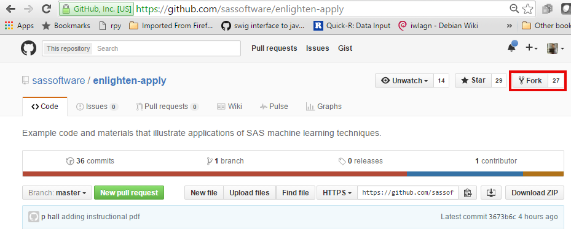
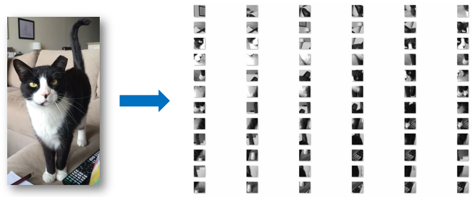
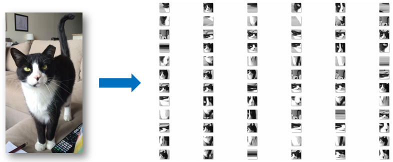
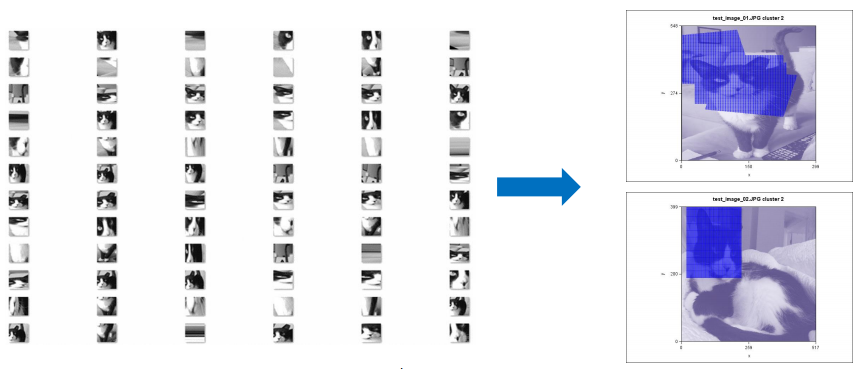
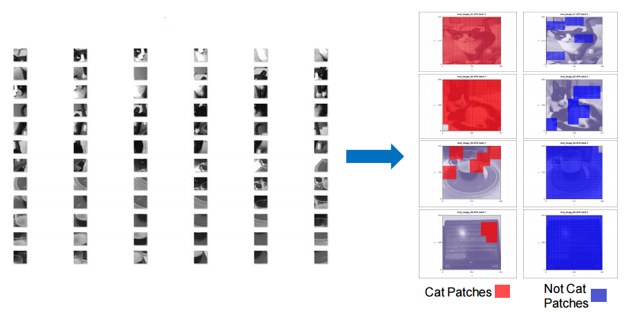

## License

Copyright (c) 2015 by SAS Institute Inc., Cary, NC 27513 USA

Licensed under the Apache License, Version 2.0 (the "License");
you may not use this file except in compliance with the License.
You may obtain a copy of the License at

   http://www.apache.org/licenses/LICENSE-2.0

Unless required by applicable law or agreed to in writing, software
distributed under the License is distributed on an "AS IS" BASIS,
WITHOUT WARRANTIES OR CONDITIONS OF ANY KIND, either express or implied
See the License for the specific language governing permissions and 
limitations under the License.

## SGF 2016 White Paper 

http://support.sas.com/resources/papers/proceedings16/SAS3100-2016.pdf

## Instructions

### Install required software 

Git client: https://git-scm.com/book/en/v2/Getting-Started-Installing-Git

Git lfs client https://git-lfs.github.com/

Anaconda Python: https://www.continuum.io/downloads

SAS Enterprise Miner: http://www.sas.com/en_us/software/analytics/enterprise-miner.html

### Fork and pull materials

Fork the enlighten-apply repository from: https://github.com/sassoftware/enlighten-apply



Enter the following statements on the git bash command line:

`$ mkdir enlighten-apply`
 
 
`$ cd enlighten-apply`


`$ git init`


`$ git remote add origin https://github.com/<your username>/enlighten-apply.git`


`$ git remote add upstream https://github.com/sassoftware/enlighten-apply.git`


`$ git pull origin master`


`$ git lfs install`


`$ git lfs track "*.jpg"`


`$ git lfs track "*.png"`


### Machine learn some dang cats!

This repo uses an approach based on creating many small patches of the original input images and then performing machine learning tasks on the image patches. The combination of Python and SAS files enables you to conduct different learning tasks in different orders. 


#### Preprocessing

Use threaded_tile.py to create many small uniform patches of the input images. At the command line type:

`$ cd SAS_Py_Patches_PatternRecognition`


`$ python threaded_tile.py -i cat_test_in -o test_out -t 100 -g True`



Use threaded_tile_r.py to create many patches from randomly rotated and randomly sized image segments. All patches will be downsampled to the same size. Random patches can promote the learning of scale-, translation-, and rotation- invariant features.  At the command line type:

`$  python threaded_tile_r.py -i cat_test_in -o test_out_r -v 50 -g True`



#### Unsupervised Learning

##### Clustering

Make_clusters.sas creates clusters of similar patches in the input images. Make_clusters.sas will automatically determine the number of clusters in the input image patches using the aligned box criterion (ABC). To use make_clusters.sas set the OUT_DIR variable in make_clusters.sas to the output directory created by Python. In this example, we will use the output directory created by threaded_tile_r.py, test_out_r. Start a SAS session and in the code editor enter a value for OUT_DIR and run the entire SAS file.

```sas
%let OUT_DIR = /path/to/test_out_r;
```



For more efficient processing, you can run make_clusters.sas from the features extracted by the stacked autoencoder in make_dictionary.sas. If the SAS data set hidden_output.sas7bdat exists in the OUT_DIR specified in make_clusters.sas, then clusters will automatically be made in the extracted feature space. 

For large input images, the graphical output of make_clusters.sas may require very large amounts of JVM heapspace to be allocated, > 16 GB in some test cases. This can be achieved by editing the -Xms and -Xmx JRE options to allow for larger amounts of memory to be allocated. These options can be edited in the primary sasv9.cfg file of your SAS install.

##### Dictionary Learning

Make_dictionary.sas creates a dictionary of representative images and extracts features from the input image patches. To use make_dictionary.sas set the OUT_DIR variable to the output directory created by Python. In this example, we will use the output directory created by threaded_tile_r.py, test_out_r. Start a SAS session and in the code editor enter a value for OUT_DIR and run the entire SAS file.

```sas
%let OUT_DIR = /path/to/test_out_r;
```


Make_dictionary.sas uses a stacked autoencoder neural network to create a dictionary and to extract highly representative features. A dictionary of representative images is created by the weights of the top hidden layer of the autoencoder network. The dictionary can be used to summarize a large number of images and locate interesting images. The number of dictionary images will be equal to the last element of the list variable HIDDEN_UNIT_LIST, or 50 in this example.

```sas
%let HIDDEN_UNIT_LIST = 50 25 2 25 50;
```

A compressed feature space is created by the output of the middle hidden layer of the autoencoder netowrk. The compressed feature space
can be used in subsequent learning tasks, particularly clustering. The number of extracted features will be equal to the middle element of the list variable HIDDEN_UNIT_LIST, or 2 in this example. Two is selected for the example because this enables the 2-dimensional plotting of the extracted features which can sometimes contain clusters or other informative characteristics.


#### Supervised Classification

A deep neural network (DNN) is used classify images as containing cats or as not containing cats in dnn_classifier.sas. The first step of the classification process is to create patches from images with and without cats. We will use threaded_tile.py to create small uniform patches from input images. At the command line type:

`$ python threaded_tile.py -i all_test_in -o test_out -t 100 -g True`


To use dnn_classifier.sas, you must supply a label file in CSV format with column headers 'orig_name', 'label'. Numeric labels should also be indexed starting from 1, as loop indexing generally begins with 1 in SAS programs. You must also set the OUT_DIR and LABEL_FILE variables to the appropriate values. Set the OUT_DIR to the output directory created by Python. Set LABEL_FILE to the location of the label file. Then run the entire SAS file.

```sas
%let OUT_DIR = /path/to/test_out;
%let LABEL_FILE = /path/to/labels.csv;
```

Dnn_classifier.sas will train a deep neural network and plot the results.



#### Testing

This example was tested in the following environment:

* Windows 7 Enterprise
* Intel i7-5600U @ 2.60 GHz
* 16 GB RAM
* Anaconda Python 2.7
* SAS 9.4 (TS1M2)
* SAS Enterprise Miner 13.2